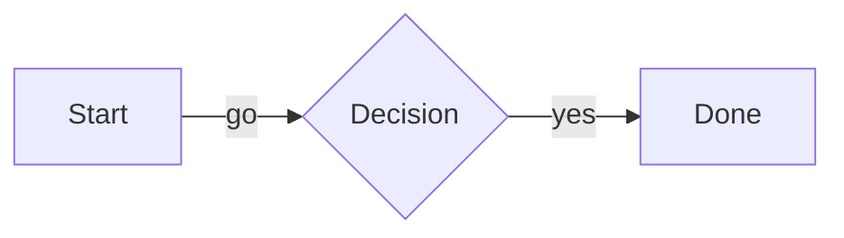

# opencode-mermaid

Render ` ```mermaid ` code blocks as inline Unicode diagrams in the
[OpenCode](https://opencode.ai) terminal UI.

[](https://github.com/000geid/opencode-mermaid/actions/workflows/ci.yml)

```
┌──────────┐            ┌────────────┐
│          │            │            │
│  Start   ├────parse──►│   Lexer    │
│          │            │            │
└─────┬────┘            └──────┬─────┘
      │                        │
      ▼                     tokens
```

Diagrams are laid out by [`beautiful-mermaid`](https://www.npmjs.com/package/beautiful-mermaid)
(pure TypeScript, zero DOM) and drawn from your active OpenCode theme — node
labels **bold**, edge labels *italic*, boxes and connectors themed.

## Features

- Renders flowcharts, state, sequence, class, ER, and `xychart-beta` diagrams.
- Colours come from the live OpenCode theme (adapts when you switch themes).
- Node labels and arrow heads are bold; edge labels are italic.
- Streaming friendly: an in-progress fence falls back to the normal code block
  and swaps to a diagram once it parses.
- Wide diagrams get a horizontal scrollbar instead of being silently cut off.
- Never breaks the transcript — any parse error falls back to the code block.

## Install

Requires OpenCode V2 (`@opencode/plugin` >= 2.0.18).

```sh
opencode plugin add github:000geid/opencode-mermaid
```

This registers the plugin with the OpenCode server; the CLI loads the `./tui`
export automatically. For a CLI-only install against a remote server, add it to
`~/.config/opencode/cli.json` instead:

```json
{
  "plugins": ["github:000geid/opencode-mermaid"]
}
```

## Usage

Write a Mermaid fence in any message:

````markdown

````

That renders as an inline diagram. The `mmd` fence language is also recognised.

## Options

Set options with the object form in `~/.config/opencode/cli.json` (or
`opencode.json`):

```json
{
  "plugins": [
    {
      "package": "opencode-mermaid",
      "options": { "colors": true, "bold": true, "italic": true, "overflow": "scroll" }
    }
  ]
}
```

| Option | Type | Default | Description |
| --- | --- | --- | --- |
| `colors` | boolean | `true` | Colour the diagram from the theme. `false` renders monochrome. |
| `bold` | boolean | `true` | Bold node labels and arrow heads. |
| `italic` | boolean | `true` | Italic edge labels. When `false`, edge labels are bold instead. |
| `overflow` | `"scroll" \| "clip" \| "code"` | `"scroll"` | How to handle diagrams wider than the terminal. |
| `maxWidth` | number | terminal − 6 | Width used by `overflow: "code"`. |

## How it works

1. `context.markdown.registerCodeBlockRenderer("mermaid", …)` intercepts the
   fence. The renderer is invoked with the code token and a `defaultRender()`
   fallback.
2. `beautiful-mermaid` lays the diagram out synchronously and returns
   truecolor ANSI text.
3. The ANSI runs are parsed back into `fg` colours, and each glyph is
   classified (by its colour and neighbouring glyphs) to decide emphasis.
4. The result becomes OpenTUI `StyledText` inside a bordered box.

Theme mapping:

| Diagram element | OpenCode token |
| --- | --- |
| Labels (node + edge) | `text.base` |
| Node borders | `border.base` |
| Edge lines | `text.muted` |
| Arrow heads / chart series 0 | `markdown.link` |
| Chart background shading | `background.base` |

### Wide diagrams

Diagrams are never wrapped — wrapping would destroy the layout. Instead, by
default the diagram sits in a horizontal `ScrollBox`. OpenTUI measures the real
container width at layout time (so an open sidebar or a resize is handled
correctly) and hides the scrollbar when the content fits. Before that, the
diagram is re-rendered with tighter spacing if that actually narrows it.

Use `overflow: "clip"` for the previous clip-in-place behaviour, or
`overflow: "code"` to fall back to the source block when the diagram is wider
than `maxWidth`.

## Supported diagrams

Flowchart (`graph` / `flowchart`, all directions), state (`stateDiagram-v2`),
sequence (`sequenceDiagram`), class (`classDiagram`), ER (`erDiagram`), and XY
charts (`xychart-beta`).

## Limitations

- `linkStyle` colour overrides are not applied by the ASCII engine (the SVG
  renderer supports them; this plugin does not).
- Italic edge-label detection is a heuristic. In some layouts an edge label is
  bold rather than italic, because node and edge labels share one colour.
- Subgraphs and nested states render, but the layout engine routes them
  imperfectly; ER relationship labels can overlap or truncate.
- Diagram width is limited by the scroll container; very wide diagrams require
  scrolling.

## Development

```sh
npm install
npm run check   # tsc --noEmit + unit tests
npm test        # unit tests only
```

The plugin is split so the rendering pipeline (`src/render.ts`) is free of
renderables and unit-testable without a terminal.

## Local development

OpenCode loads local plugins from `<global-config>/plugins/<name>/` and expects
the entrypoints at the **package root**. Two things that are easy to get wrong:

- Plugin discovery **ignores symlinked directories** — a symlink into a checkout
  will silently not load.
- `index.ts` and `tui.ts` must exist at the package root; the `package.json`
  `exports` map alone is not enough for discovery.

So to dogfood a checkout, clone it directly into the plugins directory:

```sh
git clone https://github.com/000geid/opencode-mermaid \
  ~/.config/opencode/plugins/opencode-mermaid
```

Running OpenCode instances hot-reload the plugin when its files change.

## Credits

- Rendering by [`beautiful-mermaid`](https://github.com/lukilabs/beautiful-mermaid),
  whose ASCII engine is a port of
  [mermaid-ascii](https://github.com/AlexanderGrooff/mermaid-ascii) by Alexander
  Grooff.
- Built for the [OpenCode](https://opencode.ai) V2 plugin API.

## License

[MIT](./LICENSE)
